<div align="center">

</div>

<br/>

<div align="center">

[](https://www.himanshupandey.me/)
[](https://www.linkedin.com/in/himanshupandey14)
[](https://leetcode.com/u/userxx/)
[](https://github.com/14-himanshu)

</div>


<br/>

<div align="center">

```
  CS Student  ·  Full-Stack Engineer  ·  Building things that scale
  React / Next.js  ·  Node.js  ·  MongoDB  ·  AI Integrations
```

</div>

<br/>

<div align="center">


<br/><br/>

<br/><br/>


</div>

<br/>


<br/>

<div align="center">


&nbsp;&nbsp;


</div>

<br/>

<div align="center">

</div>

<br/>


<br/>

<div align="center">

**Projects**

[](https://github.com/14-himanshu)
&nbsp;
[](https://github.com/14-himanshu)
&nbsp;
[](https://github.com/14-himanshu)

</div>

<br/>

<div align="center">


</div>

<br/>


<br/>

<div align="center">
<picture>
  <source media="(prefers-color-scheme: dark)" srcset="https://raw.githubusercontent.com/14-himanshu/14-himanshu/output/github-contribution-grid-snake-dark.svg">
  
</picture>
</div>

<br/>

<div align="center">

<br/>
<sub><code>Himanshu Pandey · Full-Stack Developer · himanshupandey.me</code></sub>
</div>
