<!-- Pure SVG Animated Hero Banner (No GIFs!) -->

 

<table align="center" border="0" width="100%" style="background-color: #050510;">
<tr>
  <td width="100%" style="padding: 20px;">
    <h3><code style="color: #00FF9D;">/// SYS.ADMIN: HIMANSHU PANDEY ///</code></h3>
     
    <code>> ROLE : SOFTWARE ENGINEER [LVL 99]</code> 
    <code>> BASE : EARTH ORBIT</code> 
    <code>> FOCUS: WEB DEV, ALGORITHMS, 3D ENGINES</code> 
    <code>> STATE: CHARTING NEW GALAXIES...</code> 
      
    
    
    
  </td>
</tr>
</table>

 

<!-- Animated SVG Starry Divider -->

  

 

### <code style="color: #00FF9D;">/// EQUIPPED_GEAR</code>

<table width="100%" align="center">
<tr>
  <td align="center">  <code>PYTHON</code></td>
  <td align="center">  <code>C++</code></td>
  <td align="center">  <code>JS</code></td>
  <td align="center">  <code>REACT</code></td>
</tr>
<tr>
  <td align="center">   <code>TYPESCRIPT</code></td>
  <td align="center">   <code>NEXT.JS</code></td>
  <td align="center">   <code>DOCKER</code></td>
  <td align="center">   <code>GIT</code></td>
</tr>
</table>

 

  

 

### <code style="color: #00FF9D;">/// TELEMETRY_DATA</code>

  
  

 

### <code style="color: #00FF9D;">/// CONTRIBUTION_GRID [SNAKE_AI_ENGAGED]</code>

  <picture>
    <source media="(prefers-color-scheme: dark)" srcset="https://raw.githubusercontent.com/platane/snk/output/github-contribution-grid-snake-dark.svg">
    <!-- Note: SVG files are used here, not GIFs -->
    
  </picture>

 

<!-- Outro Animated SVG -->

  

