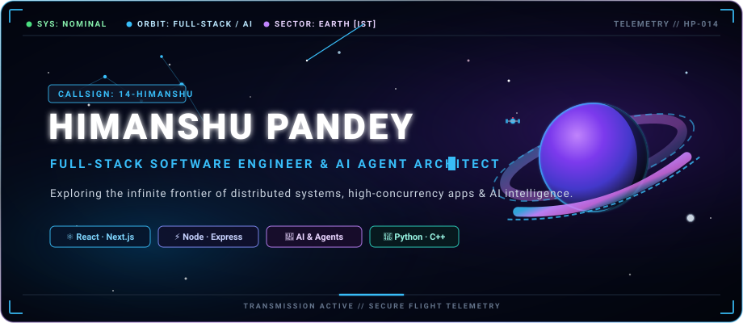

<div align="center">
  
</div>

<br/>

<div align="center">

[](https://www.himanshupandey.me/)
&nbsp;
[](https://www.linkedin.com/in/himanshupandey14)
&nbsp;
[](https://github.com/14-himanshu)

<br/><br/>


</div>

<br/>

<div align="center">
  <picture>
    <source media="(prefers-color-scheme: dark)" srcset="./divider-dark.svg">
    <source media="(prefers-color-scheme: light)" srcset="./divider-light.svg">
    
  </picture>
</div>

<br/>

<div align="center">

<picture>
  <source media="(prefers-color-scheme: dark)" srcset="https://readme-typing-svg.demolab.com?font=Fira+Code&weight=600&size=19&pause=1000&color=00D4FF&center=true&vCenter=true&width=650&lines=Full-Stack+Software+Engineer;Architecting+Scalable+Distributed+Systems;Engineering+Autonomous+AI+Agents;Designing+High-Performance+Web+Applications">
  <source media="(prefers-color-scheme: light)" srcset="https://readme-typing-svg.demolab.com?font=Fira+Code&weight=600&size=19&pause=1000&color=0284C7&center=true&vCenter=true&width=650&lines=Full-Stack+Software+Engineer;Architecting+Scalable+Distributed+Systems;Engineering+Autonomous+AI+Agents;Designing+High-Performance+Web+Applications">
  
</picture>

</div>

<br/>

### // MISSION BRIEFING : FLIGHT LOG

```text
+-----------------------------------------------------------------------------+
|  PILOT / ENGINEER   : Himanshu Pandey                                       |
|  BASE COORDINATES   : Earth (India · UTC+5:30)                              |
|  CURRENT TRAJECTORY : Full-Stack Engineering, Real-Time Systems & AI       |
|  PRIMARY DIRECTIVE  : Designing resilient distributed architectures        |
|  CORE SPECIALTY     : Event-Driven Systems & Scalable Architecture          |
+-----------------------------------------------------------------------------+
```

<br/>

<div align="center">
  <picture>
    <source media="(prefers-color-scheme: dark)" srcset="./divider-dark.svg">
    <source media="(prefers-color-scheme: light)" srcset="./divider-light.svg">
    
  </picture>
</div>

<br/>

### // AVIONICS & SUBSYSTEMS : TECH STACK

<div align="center">

**[ ORBITAL INTERFACE ] — Frontend Systems**
<br/>


<br/><br/>

**[ PROPULSION & CORE ] — Backend & Distributed Data**
<br/>


<br/><br/>

**[ FLIGHT COMPUTERS & LOGIC ] — Languages & Intelligence**
<br/>

<br/>

&nbsp;

&nbsp;


<br/><br/>

**[ NAVIGATIONAL EQUIPMENT ] — Tools & Environment**
<br/>


</div>

<br/>

<div align="center">
  <picture>
    <source media="(prefers-color-scheme: dark)" srcset="./divider-dark.svg">
    <source media="(prefers-color-scheme: light)" srcset="./divider-light.svg">
    
  </picture>
</div>

<br/>

### // ORBITAL TELEMETRY : STATS & ACTIVITY

<div align="center">

<picture>
  <source media="(prefers-color-scheme: dark)" srcset="https://github-readme-stats-eight-nu-63.vercel.app/api?username=14-himanshu&show_icons=true&title_color=00d4ff&text_color=8ab4d4&icon_color=00d4ff&bg_color=060918&border_color=1e293b&hide_border=false&rank_icon=github&card_width=400&v=2">
  <source media="(prefers-color-scheme: light)" srcset="https://github-readme-stats-eight-nu-63.vercel.app/api?username=14-himanshu&show_icons=true&title_color=0284c7&text_color=334155&icon_color=0284c7&bg_color=ffffff&border_color=e2e8f0&hide_border=false&rank_icon=github&card_width=400&v=2">
  
</picture>
&nbsp;&nbsp;
<picture>
  <source media="(prefers-color-scheme: dark)" srcset="https://github-readme-streak-stats-six.vercel.app/?user=14-himanshu&background=060918&border=1e293b&ring=00d4ff&fire=bf5fff&currStreakLabel=00d4ff&sideLabels=8ab4d4&currStreakNum=ffffff&sideNums=8ab4d4&dates=556a82&hide_border=false&v=2">
  <source media="(prefers-color-scheme: light)" srcset="https://github-readme-streak-stats-six.vercel.app/?user=14-himanshu&background=ffffff&border=e2e8f0&ring=0284c7&fire=7c3aed&currStreakLabel=0284c7&sideLabels=64748b&currStreakNum=0f172a&sideNums=475569&dates=94a3b8&hide_border=false&v=2">
  
</picture>

<br/><br/>

<picture>
  <source media="(prefers-color-scheme: dark)" srcset="https://github-readme-stats-eight-nu-63.vercel.app/api/top-langs/?username=14-himanshu&layout=compact&bg_color=060918&border_color=1e293b&title_color=00d4ff&text_color=8ab4d4&hide_border=false&langs_count=8&v=2">
  <source media="(prefers-color-scheme: light)" srcset="https://github-readme-stats-eight-nu-63.vercel.app/api/top-langs/?username=14-himanshu&layout=compact&bg_color=ffffff&border_color=e2e8f0&title_color=0284c7&text_color=334155&hide_border=false&langs_count=8&v=2">
  
</picture>

</div>

<br/>

<div align="center">
  <picture>
    <source media="(prefers-color-scheme: dark)" srcset="./divider-dark.svg">
    <source media="(prefers-color-scheme: light)" srcset="./divider-light.svg">
    
  </picture>
</div>


<br/>

### // ACTIVE EXPEDITIONS : FEATURED MISSIONS

| Mission | Objective & Telemetry | Propulsion & Tech | Status |
| :--- | :--- | :--- | :---: |
| **[Slate](https://github.com/14-himanshu/slate)** | High-concurrency real-time collaborative canvas with room-based synchronization and instant state replication. | `React` · `Node.js` · `Socket.IO` · `MongoDB` | [](https://github.com/14-himanshu/slate) |
| **[Second Brain](https://github.com/14-himanshu/secondbrain-monorepo)** | AI-driven personal knowledge platform for semantic document ingestion, contextual memory retrieval & synthesis. | `Next.js` · `TypeScript` · `OpenAI API` · `Tailwind` | [](https://github.com/14-himanshu/secondbrain-monorepo) |
| **[Vitality AI](https://github.com/14-himanshu/vitality-ai)** | Health telemetry & physical analytics platform delivering AI-guided personalized wellness coaching and metric tracking. | `React` · `Tailwind CSS` · `AI Analytics` | [](https://github.com/14-himanshu/vitality-ai) |
| **[Webhook Orchestrator](https://github.com/14-himanshu/webhook-orchestrator)** | High-throughput event delivery and webhook dispatch engine with exponential backoff retries and idempotent processing. | `Node.js` · `Express` · `Queues` · `REST API` | [](https://github.com/14-himanshu/webhook-orchestrator) |

<br/>

<div align="center">
  <picture>
    <source media="(prefers-color-scheme: dark)" srcset="./divider-dark.svg">
    <source media="(prefers-color-scheme: light)" srcset="./divider-light.svg">
    
  </picture>
</div>

<br/>

### // STELLAR TRAJECTORY : CONTRIBUTIONS

<div align="center">
<picture>
  <source media="(prefers-color-scheme: dark)" srcset="https://raw.githubusercontent.com/14-himanshu/14-himanshu/output/github-contribution-grid-snake-dark.svg?v=2">
  <source media="(prefers-color-scheme: light)" srcset="https://raw.githubusercontent.com/14-himanshu/14-himanshu/output/github-contribution-grid-snake.svg?v=2">
  
</picture>
</div>

<br/>

<div align="center">
  <picture>
    <source media="(prefers-color-scheme: dark)" srcset="./divider-dark.svg">
    <source media="(prefers-color-scheme: light)" srcset="./divider-light.svg">
    
  </picture>
  <br/>
  <sub><code>Himanshu Pandey · Full-Stack Software Engineer · <a href="https://www.himanshupandey.me/">himanshupandey.me</a></code></sub>
</div>
